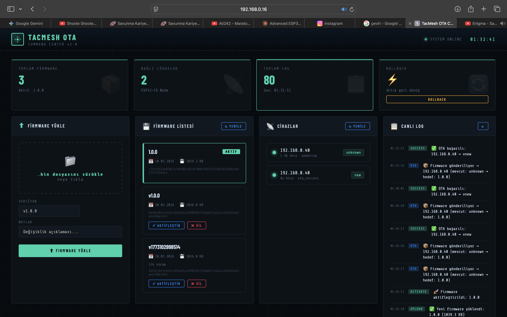

# TacMesh OTA System

ESP32-C6 üzerinde çalışan WiFi tabanlı OTA (Over-The-Air) güncelleme sistemi.

## Özellikler
- Otomatik firmware güncelleme (30 saniyede bir kontrol)
- Versiyon kontrolü (aynı versiyonu tekrar indirmiyor)
- Rollback desteği (hatalı firmware'de eski versiyona döner)
- SHA-256 hash doğrulama
- Node.js backend + taktik C2 dashboard

## Kurulum

### Gereksinimler
- ESP-IDF v5.5+
- Node.js v20+
- ESP32-C6 DevKitC

### 1. Sunucuyu Başlat
```bash
cd server
npm install
node server.js
```
Dashboard: http://localhost:3000

### 2. Firmware Ayarları
`main/simple_ota_example.c` dosyasında:
```c
#define OTA_SERVER_IP    "YOUR_SERVER_IP"  // 
#define FIRMWARE_VERSION "1.0.0"         // Mevcut versiyon
#define DEVICE_ID        "esp32c6-node-01"
```

### 3. Derle ve Flash'a Yaz
```bash
idf.py set-target esp32c6
idf.py menuconfig  # WiFi SSID ve şifreyi gir
idf.py build
idf.py -p /dev/cu.usbserial-10 flash monitor
```

## Kullanım
1. Sunucuyu başlat
2. Dashboard'dan yeni firmware yükle
3. Versiyon adını gir ve aktifleştir
4. ESP32 otomatik olarak güncellenir

## Proje Yapısı
```
├── main/
│   └── simple_ota_example.c  # ESP32 firmware
├── server/
│   ├── server.js             # Node.js backend
│   └── public/
│       └── index.html        # Dashboard
└── README.md
```
